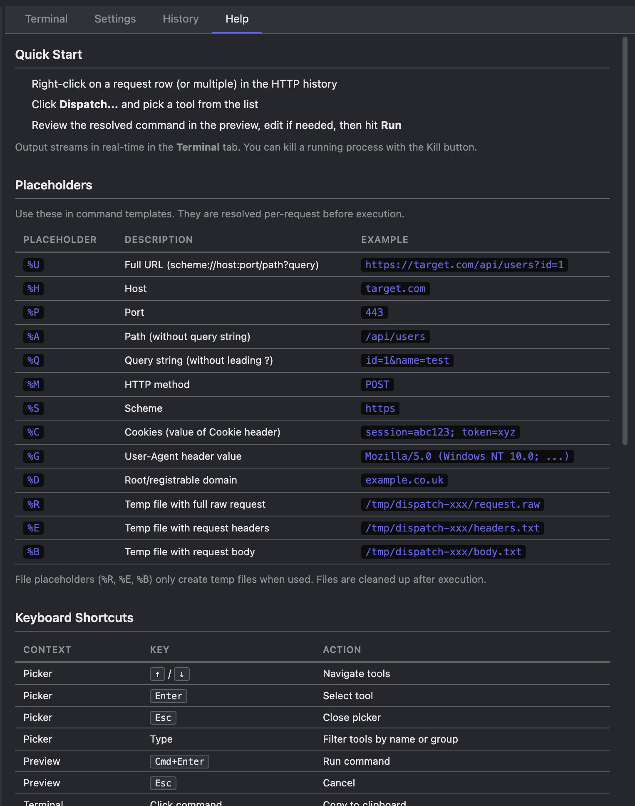

# Dispatch

A [Caido](https://caido.io) plugin to send intercepted HTTP requests to external CLI security tools (sqlmap, ffuf, nuclei, dalfox, etc.) with one click, streaming output in a built-in terminal.

Inspired by [Custom Send To](https://github.com/PortSwigger/custom-send-to) for Burp Suite.

## Features

- **Single context menu** — Right-click any request row → "Dispatch..." → pick a tool
- **15 built-in presets** — sqlmap, dalfox, ffuf, nuclei, katana, arjun, subfinder, sslscan, testssl, wpscan, droopescan, httpx, curl and more
- **Placeholder system** — `%U`, `%H`, `%R`, etc. auto-resolve from the selected request
- **Preview & edit** — See the resolved command before running, edit flags on the fly
- **Streaming terminal** — Real-time stdout/stderr output with kill support
- **Multi-select** — Select multiple requests and run a tool against all of them sequentially
- **Tool detection** — ✓ (green) if installed, ✗ (gray) if not found in PATH; shown in both picker and Settings, refreshable via "Detect Tools" button; tools marked ✗ are still selectable
- **Custom tools** — Add your own tools with any command template
- **Import/Export** — Backup and share tool configurations as JSON
- **History** — Browse past executions with filters by tool name and exit code

## Screenshots

| Tool Picker | Command Preview |
|---|---|
|  |  |

| Settings | History |
|---|---|
|  |  |

| Help |
|---|
|  |

## Installation

1. Download `dist/dispatch.zip` from [Releases](https://github.com/six2dez/dispatch/releases)
2. In Caido, go to Plugins → Install from file → Select the zip
3. The "Dispatch" sidebar entry and context menu will appear immediately

## Usage

1. Intercept or browse HTTP requests in Caido
2. Right-click a request row → **Dispatch...**
3. Search or pick a tool from the list
4. Review the resolved command in the preview dialog
5. Click **Run** — output streams live in the Terminal tab

### Multi-select

Select multiple request rows before clicking "Dispatch...". The tool runs once per request sequentially. The preview shows the first request; edits to flags apply to all.

## Placeholders

Use these in command templates. They resolve per-request before execution.

| Placeholder | Description | Example |
|---|---|---|
| `%U` | Full URL (scheme://host:port/path?query) | `https://target.com/api/users?id=1` |
| `%H` | Host | `target.com` |
| `%P` | Port | `443` |
| `%A` | Path (without query) | `/api/users` |
| `%Q` | Query string (without ?) | `id=1&name=test` |
| `%M` | HTTP method | `POST` |
| `%S` | Scheme | `https` |
| `%C` | Cookies (Cookie header value) | `session=abc123; token=xyz` |
| `%G` | User-Agent header value | `Mozilla/5.0 (Windows NT 10.0; ...)` |
| `%D` | Root/registrable domain | `example.co.uk` |
| `%R` | Temp file with full raw request | `/tmp/dispatch-xxx/request.raw` |
| `%E` | Temp file with request headers | `/tmp/dispatch-xxx/headers.txt` |
| `%B` | Temp file with request body | `/tmp/dispatch-xxx/body.txt` |

File placeholders (`%R`, `%E`, `%B`) only create temp files when used. Files are cleaned up after execution.

## Built-in Presets

| Group | Tool | Command |
|---|---|---|
| SQL Injection | sqlmap | `sqlmap -u %U --random-agent --batch` |
| SQL Injection | sqlmap (request file) | `sqlmap -r %R --random-agent --batch` |
| XSS | dalfox | `dalfox url %U --user-agent %G --context-aware --deep-domxss --detailed-analysis` |
| XSS | dalfox (request file) | `dalfox file %R --rawdata --user-agent %G --context-aware --deep-domxss --detailed-analysis` |
| Fuzzing | ffuf | `ffuf -mc all -fc 404 -r -c -H "User-Agent: "%G -u %S://%H%A/FUZZ -w <wordlist>` |
| Scanning | nuclei | `nuclei -u %U -severity info,low,medium,high,critical,unknown` |
| Crawling | katana | `katana -u %U -silent` |
| Param Discovery | arjun | `arjun -i %R` |
| Recon | subfinder + httpx | `subfinder -d %D -silent \| httpx -silent -tech-detect -status-code -title` |
| SSL | sslscan | `sslscan %H:%P` |
| SSL | testssl | `testssl.sh --color 3 %H:%P` |
| CMS | wpscan | `wpscan --random-user-agent --rua -e vp,cb,dbe,u --detection-mode aggressive --url=%U` |
| CMS | droopescan | `droopescan scan drupal -u %U -t 10` |
| Utility | httpx | `echo %U \| httpx -silent -tech-detect -status-code -title -content-length -follow-redirects` |
| Utility | curl verbose | `curl -v -k -L -A %G %U` |

Wordlist paths and API tokens (e.g., `$WPSCAN_API`) are editable in the preview dialog before running.

## Custom Tools & Categories

- Go to **Settings** → **Add Tool** to create your own commands with any placeholder
- The **Group** field accepts any text — if the category doesn't exist, it's created automatically
- A category disappears when all its tools are removed or moved to another group
- To rename a category, edit each tool in it and change the Group field
- Use **Import/Export** to backup and share your tool configurations as JSON

## Keyboard Shortcuts

| Context | Key | Action |
|---|---|---|
| Picker | `↑` / `↓` | Navigate tools |
| Picker | `Enter` | Select tool |
| Picker | `Esc` | Close picker |
| Picker | Type | Filter by name or group |
| Preview | `Cmd+Enter` | Run command |
| Preview | `Esc` | Cancel |
| Terminal | Click command | Copy to clipboard |

## Building from Source

```bash
git clone https://github.com/six2dez/dispatch.git
cd dispatch
pnpm install
pnpm run build
```

The output `dist/dispatch.zip` is ready to install in Caido.

## Security

This plugin executes arbitrary shell commands by design — it is built for security professionals who need to pipe HTTP requests to CLI tools. Key points:

- All placeholder values (%U, %H, etc.) are shell-escaped automatically using single-quote wrapping
- The preview dialog allows users to edit the resolved command before execution; edited commands are executed as-is
- Commands run via login shell (`/bin/zsh -lc` or `/bin/bash -lc`) with the user's full PATH
- The plugin does NOT execute commands without user interaction (always requires context menu click + tool selection + optional preview confirmation)
- Tool configurations imported from JSON are validated for required fields before insertion

## Notes

- Commands execute via login shell (`/bin/zsh -lc` on macOS, `/bin/bash -lc` on Linux) to inherit your full system PATH
- All placeholder values are shell-escaped (single-quote wrapped) automatically
- `shell: true` semantics — pipes, redirects, and chaining work in command templates
- Terminal output stored in SQLite is truncated to 512KB per run; full output is visible via live streaming
- Raw request for `%R` uses `getRaw().toText()` from the Caido SDK

## License

MIT
