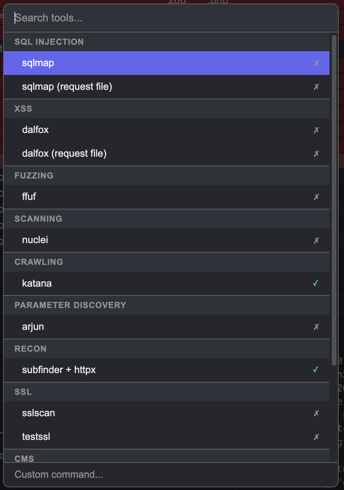
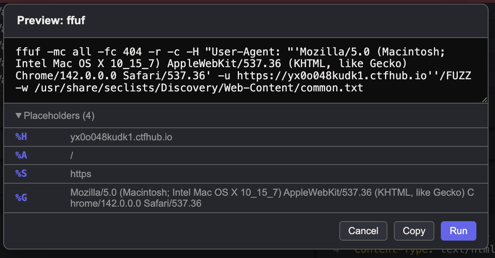
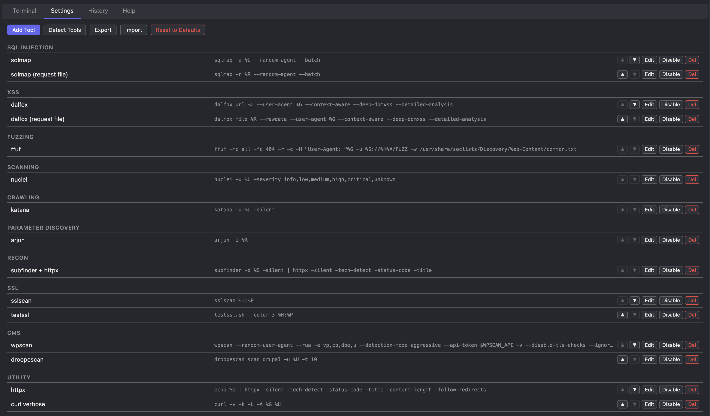
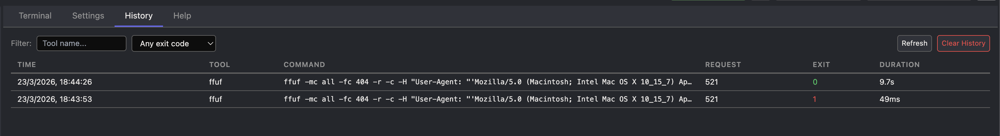

# Dispatch

[](https://github.com/six2dez/dispatch/releases/latest)
[](https://github.com/six2dez/dispatch/actions/workflows/ci.yml)
[](LICENSE)
[](https://github.com/six2dez/dispatch/releases)
[](https://github.com/six2dez/dispatch/commits/main)

A [Caido](https://caido.io) plugin to send intercepted HTTP requests to external CLI security tools (sqlmap, ffuf, nuclei, dalfox, etc.) with one click, streaming output in a built-in terminal.

Inspired by [Custom Send To](https://github.com/PortSwigger/custom-send-to) for Burp Suite.

<p align="center">
  
</p>

## Features

- **Per-tool context menu** — Right-click any request → "Dispatch: sqlmap", "Dispatch: ffuf", etc. for one-click dispatch, plus "Dispatch..." for the full picker; quick entries stay in sync with Settings changes
- **19 built-in presets** — sqlmap, dalfox, ffuf, nuclei, katana, arjun, x8, gospider, subfinder+httpx, sslscan, testssl, wpscan, droopescan, httpx, curl, LinkFinder and more
- **Placeholder system** — `%U`, `%H`, `%R`, etc. auto-resolve from the selected request
- **Preview & edit** — See the resolved command before running, edit flags on the fly
- **Streaming terminal** — Real-time stdout/stderr output with kill support
- **Multi-select** — Select multiple requests and run a tool against all of them sequentially, with live batch progress in the Terminal tab
- **Tool detection** — Shows installed/missing status for each tool, with multi-binary support for pipelines
- **Custom tools** — Add your own tools with any command template
- **Import/Export** — Backup and share tool configurations as JSON
- **History** — Browse past executions with filters by tool name and exit code, with automatic refresh as runs finish
- **Caido Findings** — Create Caido Findings from completed runs
- **Shell env vars** — Use `$VAR` or `${VAR}` in templates (resolved by login shell)
- **Binary-safe** — `%R` and `%B` preserve exact bytes for non-UTF-8 / binary request bodies
- **Caido theme integration** — Uses native CSS variables, adapts to any Caido theme

## Installation

1. Download `plugin_package.zip` (and optionally `plugin_package.zip.sig` + `public.pem` to verify) from [Releases](https://github.com/six2dez/dispatch/releases)
2. (Optional but recommended) [Verify the signature](#verifying-a-release)
3. In Caido, go to Plugins → Install from file → Select the zip
4. The "Dispatch" sidebar entry and context menu will appear immediately

## Usage

1. Intercept or browse HTTP requests in Caido
2. Right-click a request row → **Dispatch...**
3. Search or pick a tool from the list
4. Review the resolved command in the preview dialog
5. Click **Run** — output streams live in the Terminal tab

<p align="center">
  
</p>

### Multi-select

Select multiple request rows before clicking "Dispatch...". The tool runs once per request sequentially. The preview shows the first request; edits to flags apply to all, and the Terminal tab shows live batch progress while the batch is running.

### Environment Variables

Use `$VAR` or `${VAR}` in command templates to reference shell environment variables. Since commands run via login shell, all your system environment variables are available.

Example: `wpscan --url=%U --api-token $WPSCAN_API`

## Placeholders

Use these in command templates. They resolve per-request before execution.

| Placeholder | Description | Example |
|---|---|---|
| `%U` | Full URL (scheme://host:port/path?query) | `https://target.com/api/users?id=1` |
| `%H` | Host | `target.com` |
| `%P` | Port | `443` |
| `%A` | Path (without query, preserves trailing slash) | `/api/users/` |
| `%Q` | Query string (without ?) | `id=1&name=test` |
| `%M` | HTTP method | `POST` |
| `%S` | Scheme | `https` |
| `%C` | Cookies (Cookie header value) | `session=abc123; token=xyz` |
| `%G` | User-Agent header value | `Mozilla/5.0 (Windows NT 10.0; ...)` |
| `%D` | Root/registrable domain | `example.co.uk` |
| `%R` | Temp file with full raw request (binary-safe) | `/tmp/dispatch-xxx/request.raw` |
| `%E` | Temp file with request headers | `/tmp/dispatch-xxx/headers.txt` |
| `%B` | Temp file with request body (binary-safe) | `/tmp/dispatch-xxx/body.txt` |

File placeholders (`%R`, `%E`, `%B`) only create temp files when used. Files are cleaned up after execution. `%R` and `%B` use raw bytes to preserve binary content without UTF-8 corruption.

## Built-in Presets

| Group | Tool | Command |
|---|---|---|
| SQL Injection | sqlmap | `sqlmap -u %U --random-agent --batch` |
| SQL Injection | sqlmap (request file) | `sqlmap -r %R --random-agent --batch` |
| XSS | dalfox | `dalfox url %U --user-agent %G --context-aware --deep-domxss --detailed-analysis` |
| XSS | dalfox (request file) | `dalfox file %R --rawdata --user-agent %G --context-aware --deep-domxss --detailed-analysis` |
| Fuzzing | ffuf | `ffuf -mc all -fc 404 -r -c -H "User-Agent: "%G -u %S://%H%A/FUZZ -w WORDLIST` |
| Fuzzing | x8 (param discovery) | `x8 -u %U -w WORDLIST` |
| Scanning | nuclei | `nuclei -u %U -severity info,low,medium,high,critical,unknown` |
| Scanning | nuclei (request file) | `nuclei -l %R -severity info,low,medium,high,critical,unknown` |
| Crawling | katana | `katana -u %U -silent` |
| Crawling | gospider | `gospider -s %U -d 2 --sitemap --robots` |
| Param Discovery | arjun | `arjun -i %R` |
| Recon | subfinder + httpx | `subfinder -d %D -silent \| httpx -silent -tech-detect -status-code -title` |
| SSL | sslscan | `sslscan %H:%P` |
| SSL | testssl | `testssl.sh --color 3 %H:%P` |
| CMS | wpscan | `wpscan --random-user-agent --rua -e vp,cb,dbe,u --detection-mode aggressive --api-token $WPSCAN_API -v --disable-tls-checks --ignore-main-redirect --url=%U` |
| CMS | droopescan | `droopescan scan drupal -u %U -t 10` |
| JS Analysis | LinkFinder | `linkfinder -i %U -o cli` |
| Utility | httpx | `echo %U \| httpx -silent -tech-detect -status-code -title -content-length -follow-redirects` |
| Utility | curl verbose | `curl -v -k -L -A %G %U` |

Replace `WORDLIST` in the preview dialog with your actual wordlist path before running.

## Custom Tools & Categories

- Go to **Settings** → **Add Tool** to create your own commands with any placeholder
- The **Group** field accepts any text — if the category doesn't exist, it's created automatically
- A category disappears when all its tools are removed or moved to another group
- Use **Import/Export** to backup and share your tool configurations as JSON
- Quick-dispatch entries update automatically after you add, edit, disable, or remove a tool in Settings

<p align="center">
  
</p>

## History & Findings

Every run lands in the **History** tab with exit code, duration, and full output.
Filter by tool name or exit code, reopen any run's stdout/stderr, or click
**Create Finding** to file a Caido Finding linked to the original request and the
tool output.

<p align="center">
  
</p>

## Keyboard Shortcuts

| Context | Key | Action |
|---|---|---|
| Picker | `↑` / `↓` | Navigate tools |
| Picker | `Enter` | Select tool |
| Picker | `Esc` | Close picker |
| Picker | Type | Filter by name or group |
| Preview | `Cmd+Enter` | Run command |
| Preview | `Esc` | Cancel |
| Terminal | Click command | Copy to clipboard |

## Building from Source

Requires Node.js ≥ 20 and pnpm ≥ 9 (pin your version with the provided `.nvmrc`).

```bash
git clone https://github.com/six2dez/dispatch.git
cd dispatch
pnpm install
pnpm run lint
pnpm run typecheck
pnpm run build
```

The output `dist/plugin_package.zip` is ready to install in Caido.

## Verifying a Release

Every release publishes `plugin_package.zip` alongside `plugin_package.zip.sig` (ED25519
signature) and `public.pem` (verification key). To confirm a download has not
been tampered with:

```sh
openssl pkeyutl -verify \
  -pubin -inkey public.pem \
  -rawin -in plugin_package.zip \
  -sigfile plugin_package.zip.sig
```

A successful verification prints `Signature Verified Successfully`. Any other
output means the file was modified or the wrong key was used — do not install.

## Platform Support

- **macOS** and **Linux** are first-class: commands run through your login
  shell (`/bin/zsh -lc` on macOS, `/bin/bash -lc` elsewhere).
- **Windows** is **not directly supported** — use WSL and install Caido + the
  CLI tools inside the WSL distro, or run Caido in a Linux VM.

## Troubleshooting

- **Tool detected as missing but it's installed**: Dispatch resolves tools
  through a login shell, so it sees the same `PATH` you get in a fresh terminal
  tab. Make sure your tool is exported from `~/.zshrc`, `~/.zprofile`,
  `~/.bash_profile`, or `~/.bashrc` (depending on your shell), not only from a
  project-local env.
- **Command edited in preview doesn't use my env var**: env vars like
  `$WPSCAN_API` are expanded by the login shell at run-time. If the variable
  isn't set in your shell profile, it silently expands to an empty string.
  Check with `env | grep WPSCAN_API` in a terminal tab.
- **Process stays running after hitting Kill**: Dispatch terminates the entire
  process group. If a tool double-forks into a daemon it may survive; kill it
  manually with `pkill -f toolname`.
- **History shows truncated output**: buffered output is capped at 512 KB per
  stream (stdout and stderr). Redirect the tool's output to a file in the
  command template if you need the full log (e.g. `nuclei ... -o /tmp/out.txt`).
- **Signature verification fails**: make sure you downloaded `public.pem` from
  the same release, not from the repo. The key is attached to every release
  from 0.3 onward.

## Security

This plugin executes arbitrary shell commands by design — it is built for security professionals who need to pipe HTTP requests to CLI tools. Key points:

- All placeholder values (%U, %H, etc.) are shell-escaped automatically using single-quote wrapping
- The preview dialog allows editing the resolved command before execution; edited commands are executed as-is
- Commands run via login shell (`/bin/zsh -lc` on macOS, `/bin/bash -lc` on Linux) with the user's full PATH
- The plugin does NOT execute commands without user interaction (always requires context menu click + tool selection + optional preview confirmation)
- `%R` and `%B` file placeholders write binary-safe data using `toBytes()`/`toRaw()` to preserve exact request content
- Kill terminates the entire process group (pipes, subprocesses), not just the parent shell
- Tool configurations imported from JSON get new IDs and cannot overwrite existing tools
- Maximum 10 concurrent processes to prevent accidental resource exhaustion

## Notes

- Commands execute via login shell (`/bin/zsh -lc` on macOS, `/bin/bash -lc` on Linux) to inherit your full system PATH
- All placeholder values are shell-escaped (single-quote wrapped) automatically
- Pipes, redirects, and chaining work in command templates
- Terminal output stored in SQLite is truncated to 512KB per stream; the in-app terminal also caps buffered stdout/stderr to 512KB each
- Batch execution continues even if individual requests fail

## License

MIT
